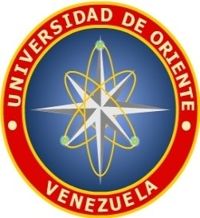

# Materias Computación

Repositorio creado para almacenar información y documentos pertinentes al departamento de Computación y Sistemas de la Universidad de Oriente, Núcleo Anzoátegui de la República Bolivariana de Venezuela.
